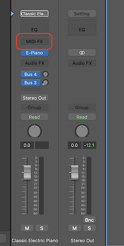
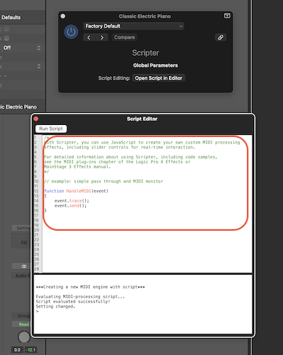
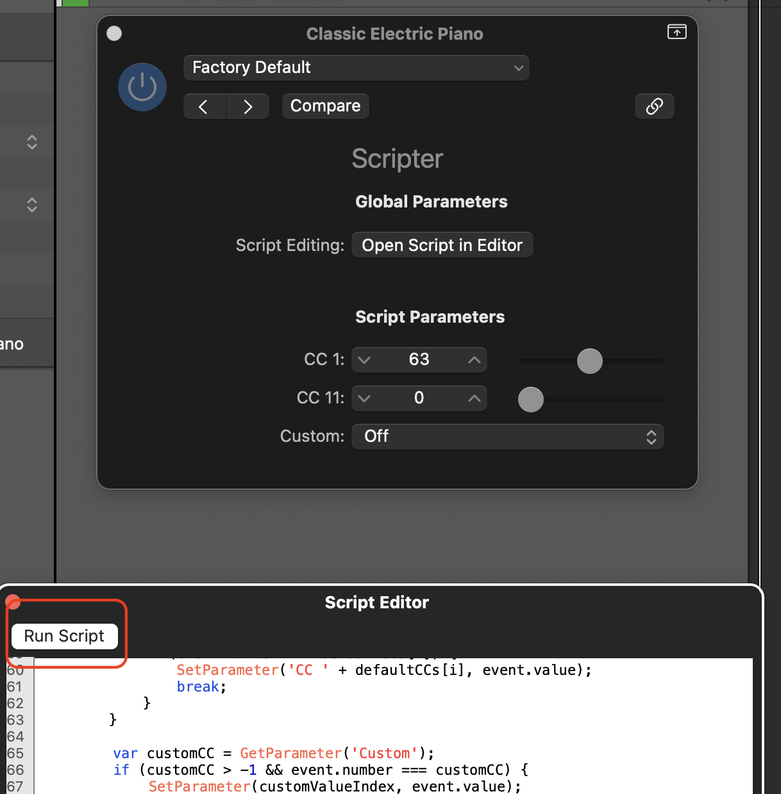
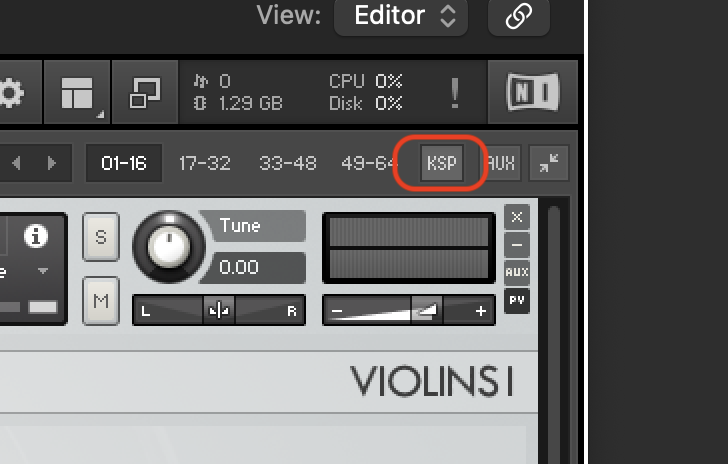

# MIDI CC Monitor

Monitor CC (Control Change) events in Kontakt and Logic Pro.

## Description

Using the modwheel (CC1) and expression (CC11) is essential for getting realistic performances with most instrument patches. Not every library displays the current CC1 and CC11 values in the UI though.

Sometimes when you're in the flow of creating music, you'll fiddle with the modwheel and/or expression at various levels during multiple midi recordings. When you finally get a performance you like, you may not have actually changed the modwheel during your performance, so that data won't be recorded with the region.

Without recording that automation data, it can easily get lost later as you put down more regions on the track and change the modwheel or expression. So through experience you'll often want to get that CC data added to the track, but if the library doesn't show it in the UI you're often guessing or approximating what it actually was set to.

These scripts will let you get that data after the fact without any guesswork.

The first script, [Midi CC Monitor.js](<Midi CC Monitor.js>) works on any Logic Pro patch as a MIDI FX Scripter plugin. As long as you have this on the channel strip before you record anything (and turned on), you'll always have the exact CC values for that patch at any given time. Simply take that value and add it to the region automation.

The second script, [Midi CC Monitor.ksp](<Midi CC Monitor.ksp>), only works with Kontakt patches, however it also works even if it wasn't loaded before your recording. It also works in any DAW, not just Logic Pro.

## Usage

There are two different scripts depending on where and how you'd like to monitor CC values.

### Any Instrument in Logic Pro

[Midi CC Monitor.js](<Midi CC Monitor.js>) is used as a [Logic Pro Scripter](https://support.apple.com/guide/logicpro/use-the-scripter-lgce728c68f6/mac) script.

1. On the instrument channel strip, add a new Scripter instance under MIDI FX:
   
   
2. Replace the default script with the contents of [Midi CC Monitor.js](<Midi CC Monitor.js>) in the editor window:
   
3. Click the "Run Script" button:
   
4. Save the script for future use:
   

Be sure the Scripter plugin is turned on at the start of your session. It can be turned off when it's no longer needed.

You can also add additional CC numbers to monitor at the top of the script file.

_Pro Tip: Add it to the instruments in your template!_

### Kontakt Instruments

[Midi CC Monitor.ksp](<Midi CC Monitor.ksp>) is used as a [multi-script](https://www.native-instruments.com/ni-tech-manuals/ksp-manual/en/multi-script). The benefit of using this is that it doesn't have to be added beforehand, which makes it easier to use and more performant. It only works on Kontakt instruments though.

1. At any point when you want to see what a CC value is, bring up the Kontakt window and click on the **KSP** button:
   
2. Add the contents of [Midi CC Monitor.ksp](<Midi CC Monitor.ksp>) to the script editor window and click the Apply button:
   
3. Click on the Refresh button to display the last set CC values. Leave it on to continuously monitor:
   
4. Save it as a preset for future use:
   

The text-field on the right allows you to monitor one additional CC value. Edit the script to monitor more than that.
